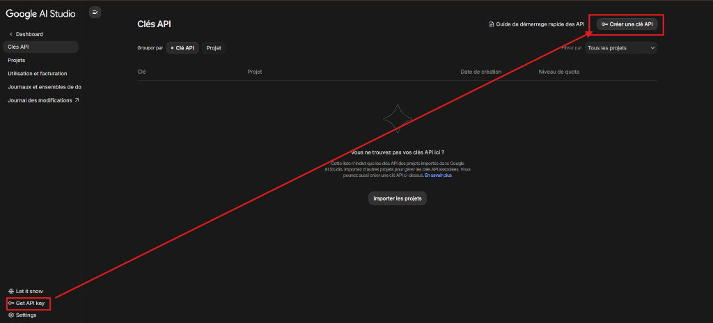
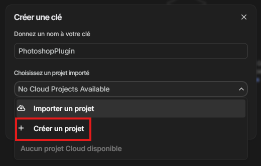
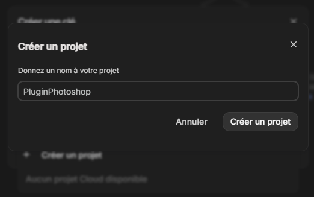
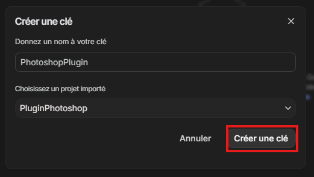
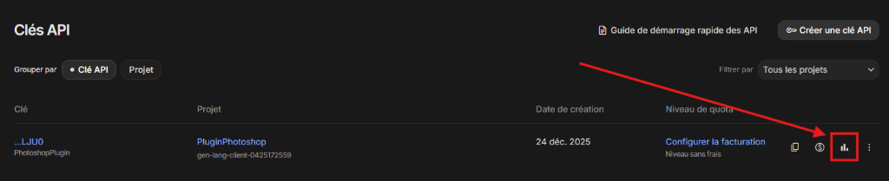
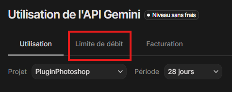
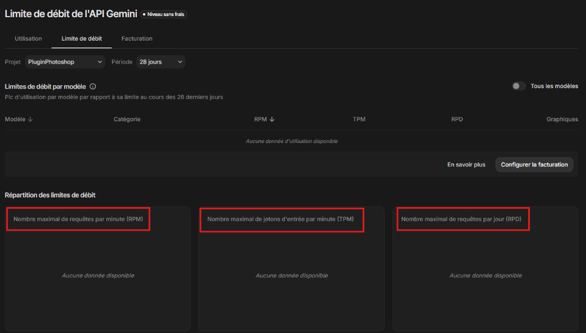
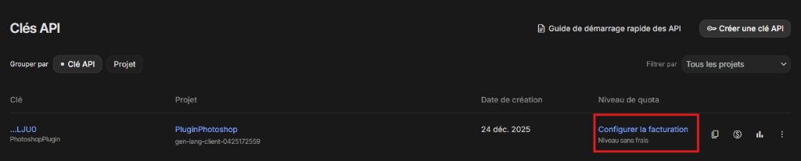
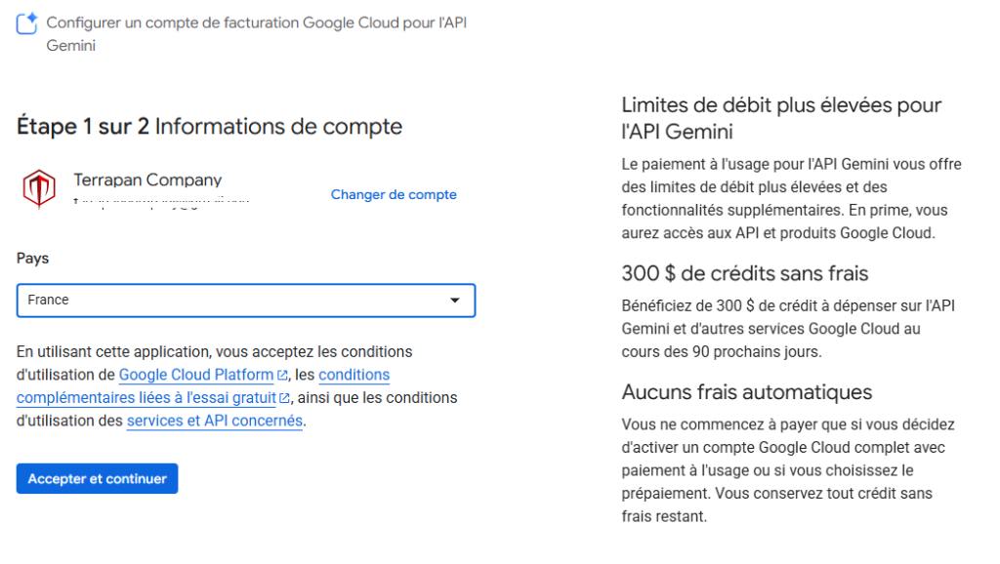

# 🔑 How to Configure Your API Key

This guide will walk you through the process of getting a free API key from Google AI Studio and configuring it in the Nano Banana plugin.

## Step 1: Get Your API Key from Google

1.  **Visit Google AI Studio**: Go to [https://aistudio.google.com/](https://aistudio.google.com/).
2.  **Sign In**: Log in with your Google account.
3.  **Create API Key**:
    *   Click on the **"Get API key"** button (usually on the top left or in the settings menu).
    
    

    *   **Select Project**: If you don't have a project yet, click the dropdown menu and select **"Create a project"**.

    

    *   **Name Project**: Give your project a name (e.g., "PluginPhotoshop") and confirm.

    

    *   **Create Key**: With the project selected, give your key a name (optional) and click **"Create API key"** (Créer une clé).

    

4.  **Copy the Key**: Once generated, copy the key string to your clipboard. It will start with `AIza...`.

    <!-- PLACEHOLDER: Screenshot of the key copy modal -->
    <!--  -->

---

## Step 2: Configure Nano Banana

1.  **Open Photoshop**: Launch Adobe Photoshop.
2.  **Open the Plugin**: Go to `Plugins` -> `Nano Banana`.
3.  **Navigate to Setup**:
    *   If this is your first time, you will see the **Google AI Studio Setup** screen immediately.
    *   If you are already in the main interface but want to change your key, scroll to the bottom footer and click the **"Change"** button.

    <!-- PLACEHOLDER: Screenshot of the Plugin's Setup Screen -->
    <!--  -->

4.  **Paste the Key**: Paste your copied key into the **"API Key"** input field.
5.  **Save**: Click the **"Save"** button.

## Step 3: Verify Connection

*   Look for the **Status Indicator** at the bottom of the plugin panel.
*   A **Green Dot** with the text "active" means you are connected and ready to generate!

    <!-- PLACEHOLDER: Screenshot of the "Active" status indicator -->
    <!--  -->

---

## Monitoring Usage & Limits

Google AI Studio provides a free tier, but it has specific limits. If your plugin stops generating or gives errors, you might have hit a limit.

1.  **Check Usage**: On the API Keys page, click the **chart icon** next to your key.

    

2.  **View Rate Limits**: Click on the **"Rate limit"** (Limite de débit) tab.

    

3.  **Understand Limits**: You will see three main counters. If any of these are full, the API will temporarily block requests.
    *   **RPM**: Requests Per Minute (Speed limit).
    *   **TPM**: Tokens Per Minute (Volume limit).
    *   **RPD**: Requests Per Day (Daily cap).

    

---

## Increasing Quotas (Optional)

If you need higher limits, you can enable "Pay-as-you-go" billing. This serves two purposes:
1.  **Removes the Request Per Day (RPD) limit**.
2.  **Increases the RPM (Requests Per Minute)** for faster generations.

### How to Enable
1.  On your API key line, click **"Configure billing"** (Configurer la facturation).

    

2.  Follow the setup steps. You will typically receive **$300 in free credits** to start.

    

### 🎓 Student Benefit (Free Year)

If you are a student, you can get **Google AI Pro for free for 1 year**, which includes billing benefits for the API.
*   **Offer**: 12 months of Gemini Advanced + Google Cloud usage benefits.
*   **Check Eligibility**: Visit [gemini.google/students](https://gemini.google/students).

---

## Troubleshooting

*   **Red Status**: If the status is red, check your internet connection and ensure you copied the entire key without extra spaces.
*   **Quota Issues**: If you receive errors about quotas, check your usage limits on the Google AI Studio dashboard as shown above.

