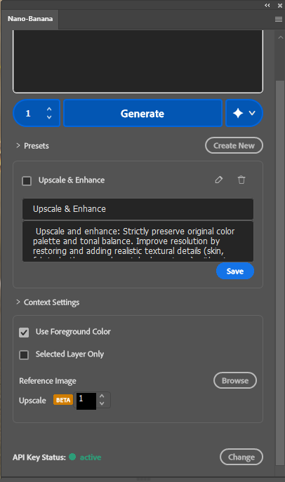

# 🍌 Nano Banana Plugin for Photoshop

**Unleash the power of Google's Gemini Models directly inside Adobe Photoshop.**

## 🚀 Overview

**Nano Banana** is a cutting-edge plugin that bridges the gap between Adobe Photoshop and Google's most advanced AI models. Unlike standard integrations, Nano Banana gives you **direct control** over the generative process, leveraging the raw power of Gemini for image generation, prompt refinement, and upscaling.

Designed for professional workflows, it seamlessly integrates into Photoshop's panel system, allowing you to generate, refine, and iterate on assets without ever leaving your canvas.

---

## ✨ Features (Always Updated)

Nano Banana is built to be a robust, professional-grade tool. Here is what makes it special:

### 🧠 **Advanced Prompt Refinement**
-   **Intelligent Rewriting**: Not sure how to describe your scene? Type a basic idea and let the "Refine prompt" feature expand it into a detailed, high-quality prompt optimized for image generation.
-   **Model Selection**: Choose specifically which Gemini model handles your prompt refinement (e.g., Gemini 3 Pro).

### 🎨 **Direct Image Generation**
-   **Gemini Power**: Generate stunning visuals using Google's latest generative models.
-   **Variations Control**: Generate anywhere from **1 to 8 variations** at once. Perfect for rapid exploration of concepts.
-   **Context Aware**:
    -   **Foreground Color Matching**: Option to force the generation to respect your currently selected foreground color.
    -   **Layer Awareness**: Can use the selected layer as context for the generation.

### 🖼️ **Reference Image Support**
-   **Reference Input**: Upload or select a reference image to guide the style and composition of the generation.
-   **Visual Feedback**: See thumbnails of your active reference images directly in the panel.

### ⚡ **Smart Workflow Tools**
-   **Presets System**: Save your best prompts as presets. Load them instantly to reuse successful styles or setups.
-   **Upscaling (BETA)**: Integrated upscaling to increase the resolution of your generated assets directly within the plugin.
-   **Status Indicator**: Real-time feedback on your API connection status.

---

## 🆚 Why Choose Nano Banana?

### 🥊 **Nano Banana vs. Adobe Firefly**

While Adobe Firefly is a great tool integrated into Photoshop, **Nano Banana** offers distinct advantages for professionals who need more control:

| Feature | 🍌 Nano Banana | 🔥 Adobe Firefly |
| :--- | :--- | :--- |
| **AI Model** | **Google Gemini** (State-of-the-art reasoning & vision) | **Google Gemini** & Adobe Models (via Firefly API/Wrappers) |
| **Privacy & Data** | **Direct Connection**. Your data goes directly to Google via your personal API key. No middleman. | Processed through Adobe's cloud ecosystem. |
| **Cost / Quota** | **Flexible**. Use Google's generous free tier or your own paid quota. You control the spend. | tied to Adobe Creative Cloud "Generative Credits". Running out means paying more or slower speeds. |
| **Censorship/Refusals** | **Standard Google Safety Settings**. Often less restrictive on creative concepts than Adobe's strict stock-safe guardrails. | Highly restricted to ensure "safe for work" stock-image style results. |
| **Transparency** | **Direct API Access**. You know exactly what model is being used. | "Black box" model updates. |
| **Instant Updates** | **Yes**. New models are available immediately via the API. No need to wait for a plugin update! | **No**. Must wait for Adobe to release updates. |

### 🥊 **Nano Banana vs. Stable Diffusion Plugins**

-   **Simplicity**: No complex local installation (Python, Git, VRAM requirements) needed. Nano Banana runs on the cloud, saving your computer's resources for Photoshop itself.
-   **Speed**: Leveraging Google's massive infrastructure often results in faster generation times than local GPUs.

---

## 🔑 Configuration: The Direct API Link (Very Important)

Nano Banana is designed with **Privacy** and **Performance** in mind. We do not proxy your requests. You connect **Directly** to Google.

### How to Setup
1.  **Get your Key**: Go to [Google AI Studio](https://aistudio.google.com/) and create a free API Key.
2.  **Enter in Plugin**: Paste the key into the Nano Banana "Google AI Studio Setup" screen.
3.  **Status Check**: The plugin will instantly verify the key. Look for the green "active" dot.

> **Why is this important?**
> By using your own API key, you ensure that you are getting the fastest possible response times and that your usage is not bottlenecked by a shared service. It also gives you total control over your usage limits.
>
> **Plus, no waiting for plugin updates:** When Google enhances their models on the API, you get access to that quality improvement instantly.

---

## 📥 Installation

1.  **Prerequisites**:
    -   Adobe Photoshop 2024 (v25.0) or higher.
    -   Internet connection (for API calls).

2.  **Installation Steps**:
    -   **Option A (CCX)**: If you have the `.ccx` file, simply double-click it to install via the Creative Cloud Desktop app.
    -   **Option B (Developer Mode)**:
        1.  Download the UXP Developer Tool from Adobe.
        2.  Click "Add Plugin" and select the `manifest.json` file in the `NanoBananaPluginPS` folder.
        3.  Click "Load".
        4.  Open Photoshop, and the plugin will appear in the `Plugins` menu.

---

## 📜 License

This project is licensed for personal and commercial use. Please ensure you satisfy the Terms of Service of the Google AI Studio API when using the generated images commercially.
