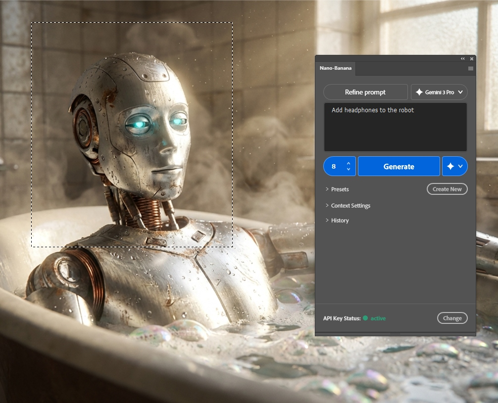
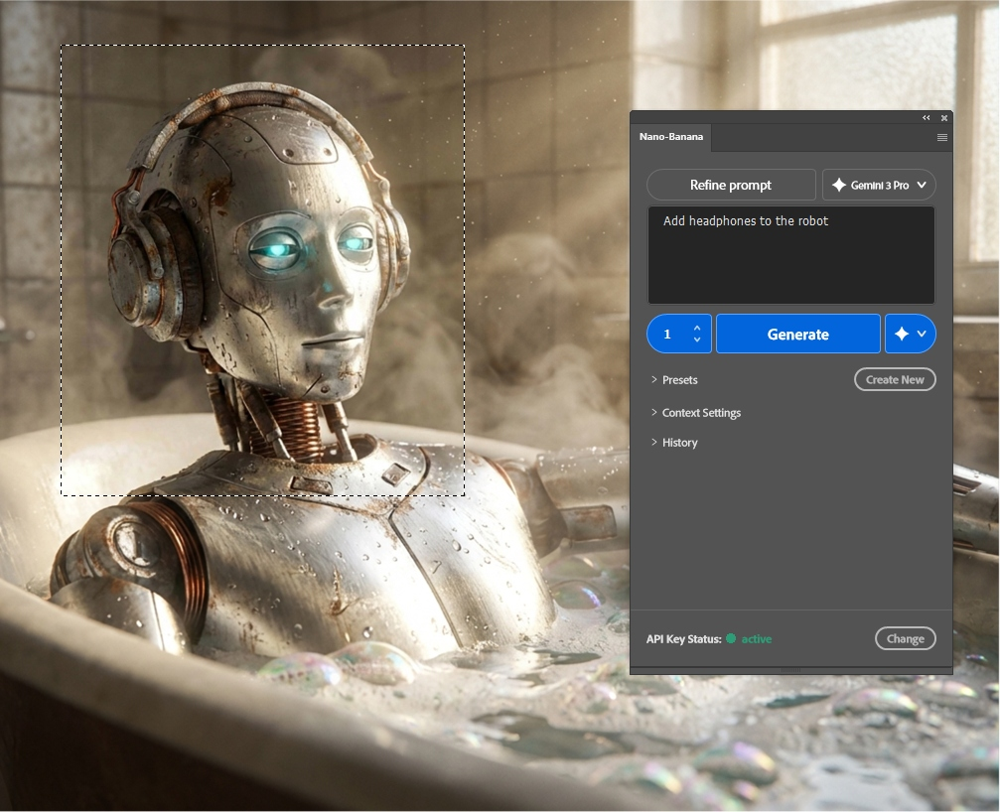
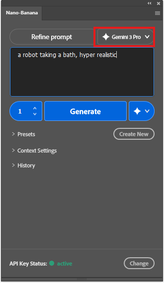
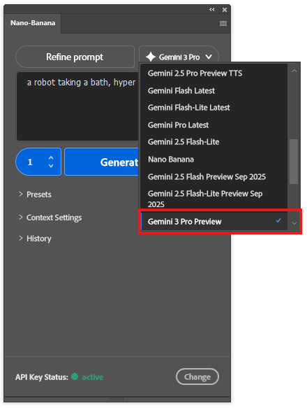
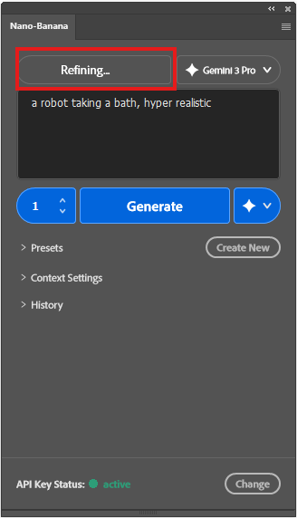
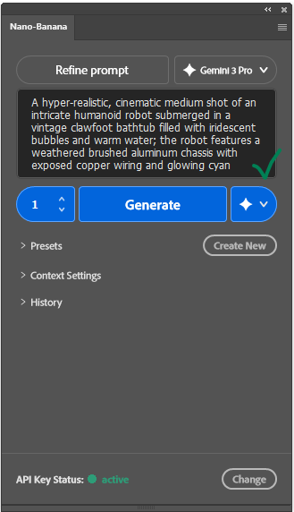

# 🍌 Nano Banana User Manual

Welcome to the complete guide for using the Nano Banana Photoshop Plugin.

## Table of Contents
1.  [Interface Overview](#interface-overview)
2.  [Generating Images](#generating-images)
3.  [Refining Prompts](#refining-prompts)
4.  [Context Settings](#context-settings)
5.  [Using Reference Images](#using-reference-images)
6.  [Presets & History](#presets--history)

---

## Interface Overview

The Nano Banana interface is designed to be clean and integrated with Photoshop. It consists of the Prompt Area, Action Buttons, Context Settings, and Footer.

<!-- PLACEHOLDER: Annotated screenshot of the full interface -->
<!--  -->

---

## Generating Images

### 1. Make a Selection & Enter Prompt
Use the Rectangular Marquee tool to select the area you want to generate in. Then, type your prompt (e.g., "Add headphones to the robot").

### 2. Choose Variations & Generate
Select how many variations you want (e.g., 4) and click **"Generate"**.

### 3. View Results
The generated images will appear as new layers.

---

## Refining Prompts

Struggling to find the right words? Let Gemini help.

1.  **Enter a Basic Idea**: Type a simple description of what you want (e.g., "a robot taking a bath").
    
    

2.  **Select a Model (Optional)**: Click the dropdown next to the "Refine prompt" button to choose which Gemini model to use for the rewriting task (e.g., Gemini 3 Pro).

    

3.  **Click "Refine prompt"**: The button will show a "Refining..." state while it processes.

    

4.  **Get Results**: The plugin will replace your text with a detailed, artistically optimized prompt safe for generation.

    

---

## Context Settings

Expand the **Context Settings** section to control how the image is generated relative to your canvas.

*   **Use Foreground Color**: Forces the AI to incorporate your currently selected Photoshop foreground color into the color palette of the image.
*   **Use only selected layer(s)**: Uses the active layer content as a base or context for the new generation (Image-to-Image).
*   **Use exact dimensions**: Generates the image at the exact pixel dimensions of your current selection or canvas (Note: this may impact generation speed or quality if dimensions are extreme).
*   **Upscale (BETA)**: Increases the resolution of the final output. Select a factor (e.g., 2x, 4x).

<!-- PLACEHOLDER: Screenshot of the Context Settings panel -->
<!--  -->

---

## Using Reference Images

You can guide the style or composition using your own images.

1.  Open **Context Settings**.
2.  Click **"Browse"** next to Reference Image.
3.  Select a file (JPG, PNG) from your computer.
4.  A thumbnail will appear. The AI will now use this image as visual inspiration.

<!-- PLACEHOLDER: Screenshot of the Reference Image uploader -->
<!--  -->

---

## Presets & History

### Presets
Save your favorite prompts to reuse them later.
1.  Expand **Presets**.
2.  Click **"Create New"**.
3.  Enter a Name and the Prompt content.
4.  Click Save. You can now click on any preset to instantly load it.

### History
The plugin remembers your last 20 generations.
1.  Expand **History**.
2.  Scroll through past prompts.
3.  Click **"Use This"** to restore the prompt and settings from that session.

<!-- PLACEHOLDER: Screenshot of Presets and History sections -->
<!--  -->
